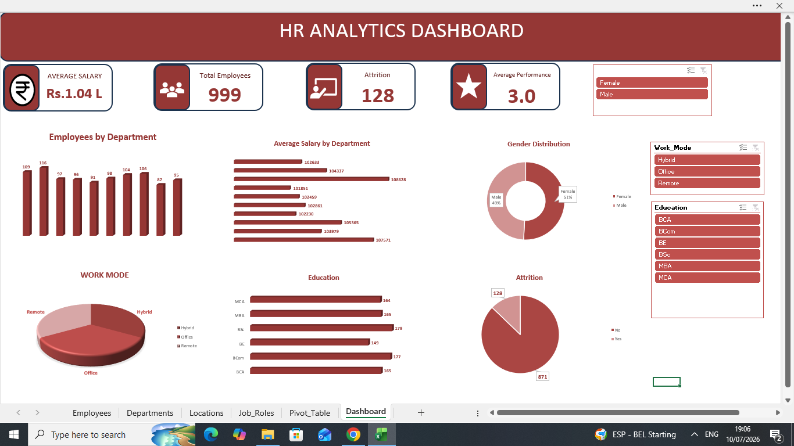

# 📊 HR Analytics Dashboard

An interactive **HR Analytics Dashboard** developed using **Microsoft Excel, MySQL, and Power BI** to analyze employee data and generate actionable workforce insights. This project demonstrates an end-to-end data analytics workflow, including data cleaning, SQL analysis, KPI creation, and interactive dashboard visualization.

---

# 📸 Dashboard Screenshot

> Replace the image below with your dashboard screenshot after uploading it to the repository.

---

# 🎯 Project Objective

The objective of this project is to analyze employee data and provide meaningful HR insights to support data-driven decision-making.

This dashboard helps HR teams:

- Monitor overall workforce statistics
- Analyze employee attrition
- Compare department-wise employee distribution
- Evaluate employee performance
- Understand workforce demographics
- Track salary and experience trends

---

# 🛠️ Tools Used

| Tool | Purpose |
|------|---------|
| 📊 Microsoft Excel | Data Cleaning & Preparation |
| 🗄️ MySQL | Data Storage & SQL Analysis |
| 📈 Microsoft Power BI | Interactive Dashboard & Data Visualization |
| 💻 SQL | Data Querying & Business Insights |
| 🌐 GitHub | Project Documentation & Portfolio |

---

# 📊 Dashboard Features

- 📌 KPI Cards
  - Total Employees
  - Active Employees
  - Attrition Count
  - Attrition Rate
  - Average Salary
  - Average Experience
  - Average Age

- 📊 Department-wise Employee Distribution

- 👨‍💼 Role-wise Employee Analysis

- 👩‍💼 Gender Distribution

- 🎓 Education-wise Analysis

- 📈 Performance Rating Analysis

- 💰 Salary Analysis

- 📅 Experience Analysis

- 🚪 Attrition Analysis

- 🎛️ Interactive Slicers for Dynamic Filtering

---

# 🔍 Key Insights

- Analyzed employee distribution across multiple departments.
- Identified workforce demographics by gender and education level.
- Compared employee performance ratings across job roles.
- Evaluated salary and experience distribution.
- Measured employee attrition and retention trends.
- Enabled interactive filtering for detailed workforce analysis.

---

# 📂 Project Files

| File | Description |
|------|-------------|
| `HR_Analytics_Excel.xlsx` | Cleaned HR dataset used for analysis |
| `HR_Analytics_SQL.sql` | SQL script containing queries used in the project |
| `HR_ANALYTICS_PBI.pbix` | Interactive Power BI dashboard |
| `Dashboard_Screenshot.png` | Dashboard preview image |
| `README.md` | Project documentation |

---

# 🚀 How to Use

1. Clone or download this repository.
2. Open **HR_Analytics_Excel.xlsx** to review the cleaned dataset.
3. Execute **HR_Analytics_SQL.sql** in MySQL Workbench.
4. Open **HR_ANALYTICS_PBI.pbix** using Microsoft Power BI Desktop.
5. Explore the dashboard using the interactive slicers and visualizations.

---

# 📈 Skills Demonstrated

- Data Cleaning
- Data Transformation
- SQL Queries
- Data Analysis
- Data Visualization
- Dashboard Development
- KPI Design
- DAX Measures
- Business Intelligence
- HR Analytics
- Excel
- MySQL
- Power BI

---

# 📌 Project Workflow

Raw HR Data

⬇️

Data Cleaning (Excel)

⬇️

SQL Analysis (MySQL)

⬇️

Data Modeling (Power BI)

⬇️

Dashboard Development

⬇️

Business Insights

---

# 👩‍💻 Author

**Pavithra T**

💼 Aspiring Data Analyst

### Connect with Me

- GitHub: https://github.com/pavithra56558
- LinkedIn: linkedin.com/in/pavithra-t-1835473a7 

---

## ⭐ If you found this project useful, consider giving it a star!
